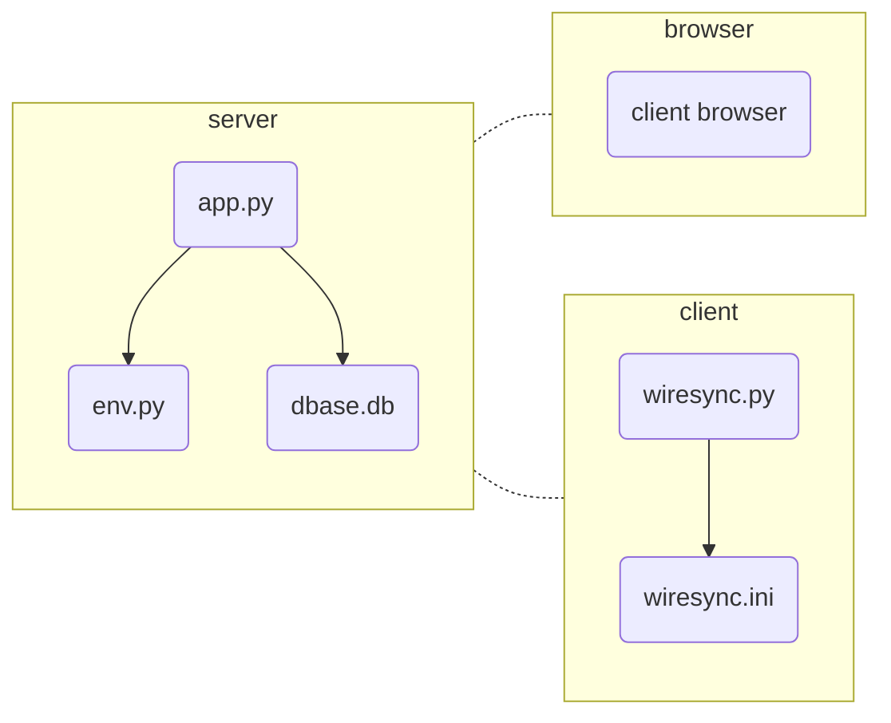

# wireSync

This is a synchronization service that keeps wireguard client ip address in sync IP address changes.  This is useful in situations where clients may not have fixed IP addresses, or are travelling.  

This relies on a publicly reachable server which is running app.py.  The clients run wiresync.py, preferrably as a service.  

## Todo list

* Finalize API communication flow
* Need to generate commands when receiving peer data
* Website interface for monitoring
* websockets interface, at the moment clients poll the server for changes.

## deployment
Dockerfile and docker-compose are set up to containerize a webserver with flask and nginx.  

still need to package client, maybe pyinstaller?  

