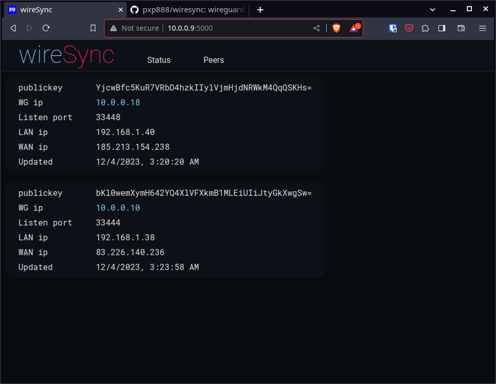
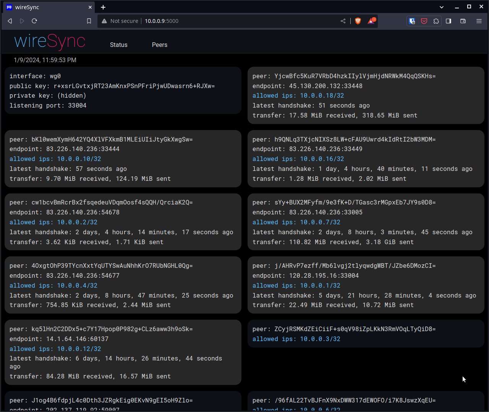
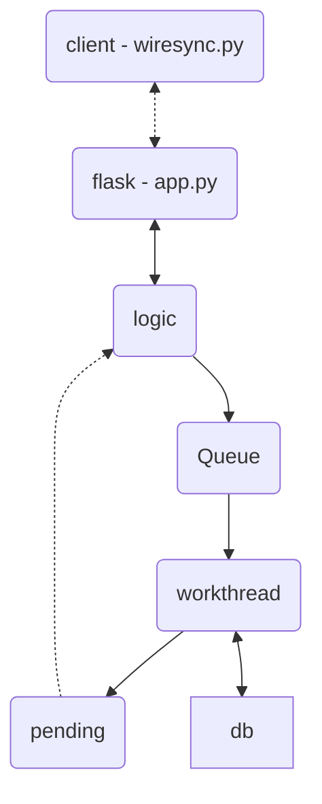

# wireSync

This is a synchronization service that keeps wireguard client ip address in sync IP address changes.  This is useful in situations where clients may not have fixed IP addresses, or are travelling.  

This relies on a publicly reachable server which is running app.py.  The clients run wiresync.py, preferrably as a service.  

Each client sends its wireguard interface details, IP address details, and the MAC address of the gateway of its current network.  

The server shares this information with other clients.  

Each client examines this, and if they have the same gateway device they try to connect directly to other clients.  If they don't they try to connect using the external IP address.  

## Security

At the moment there are no security checks in place.  Any client with access to the server can join a wireguard network, which is not ideal.  

One approach is simply to ensure that the server is only reachable over wireguard itself, which means the client must have a working wireguard connection to the server.  

## Todo list

* websockets interface, at the moment clients poll the server for changes.
* decide which security checks should be in place. 

## deployment
Dockerfile and docker-compose are set up to containerize a webserver with flask and nginx.  

still need to package client, maybe pyinstaller?  

# Structure

## Class structure

## information flow

### Standard Peer Information

|Peer info|Description|
|-|-|
|publickey|public key
|wgip|Wireguard Address
|listen_port| Wireguard listening port
|lanip|LAN Ip Address
|wanip|WAN Ip Address
|lan_name|MAC Address of gateway

## Messaging

|__client : update__||
|-|-|
|t|update|
|publickey| wireguard publickey
|wgip| wireguard IP address
|listen_port| wireguard listen port
|lanip| LAN IP address
|wanip| WAN IP address
|lan_name| Gateway MAC address

|__server : update_ack__||
|-|-|
|t|update_ack|

|__server : keys__||
|-|-|
|t|keys|
|keys|list of keys of LAN peers

|__client : getPeer__||
|-|-|
|t|getPeer|
|publickey|client public key
|targetkey|wanted client public key

|__server : getPeer_ack__||
|-|-|
|t|getPeer_ack|

|__server : peer__||
|-|-|
|t|peer|

